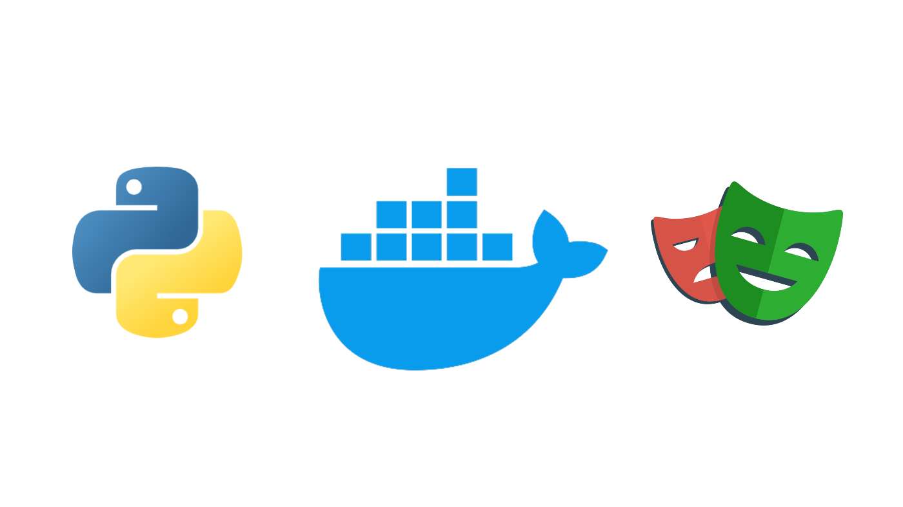
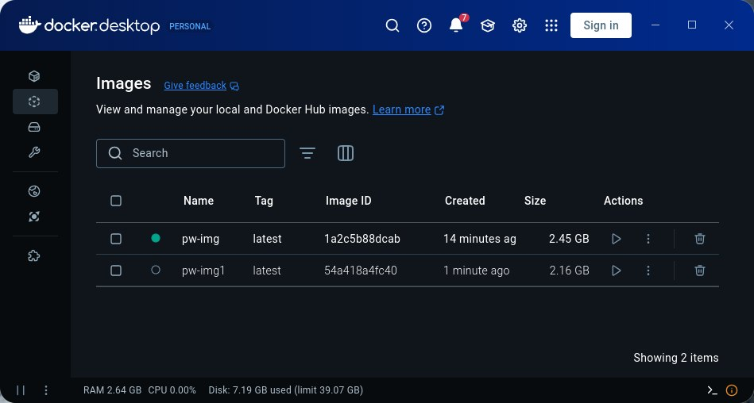
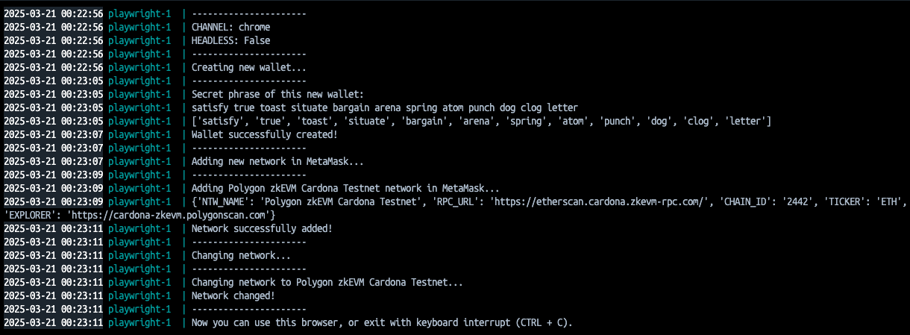

# 🎭 Running Python Playwright (using GUI) in Docker: An adventure


## 🌟 Introduction

Recently I was given a task to run a Python application written with the Playwright library and using the MetaMask extension in a Docker container. In the network, I found no normal information on how to do this, except for basic advice like: "*Use the Playwright image from Docker Hub… Check your application code…*" and so on. The problem was solved and the task was successfully completed.

Here is the link to the [repository](https://github.com/C0ldM2n/playwright-in-docker).

---
## 🔍 The Challenge

The problem with which I encountered, that the application starts and works perfectly locally, even in headless mode, but in the docker container it does not work. 

### 🚫 Attempts, Theories and Failures

#### First Attempt: Poetry Dependencies
The first thing I tried was to install the dependencies with Poetry and run the project, but it didn't work. The application simply hung, and on the second attempt to run it crashed. I decided to try to run the application with other parameters (headed, chromium), and also tried several flags related to GPU and browser work in sandbox mode. But none of this led to success.

#### Second Attempt: x11docker
The second thing I tried was [x11docker](https://github.com/mviereck/x11docker). All this, because I had the assumption that the application does not work normally because of the absence of a graphical shell or X Server. I spent a long time trying to run the project with x11docker, tried different images, flags and parameters, but this also did not lead to success. After it turned out that x11docker would not be suitable, because it is not available on macOS. The main goal of running this application in a docker container was to easily run the application from any platform.

### 💡 First Successes

It was decided to try to run the application in a container with a full-fledged graphical shell, and also with the use of [VNC](https://en.wikipedia.org/wiki/VNC). And when finally the container was built and run, it was possible to connect to the container, and run the application in the container with a graphical shell. The application started with parameters headed, chrome. Finally, it started, but the solution was not good enough, because the container image weighed more than **7 gigabytes**!

If you have an application that needs to run in a docker container, and it doesn't run in the normal python way, I suggest you try running it through a VNC container. Originally I was going to leave a whole Dockerfile for it, but it's too big due to the number of dependencies, so I'll just add a VNC related folder to [repository](https://github.com/C0ldM2n/playwright-in-docker) for test runs of the application.

This was too much for a container that should simply run the application. It was decided that the final image should weigh about **2 gigabytes**.

---
### 🎯 Final Solution

After successfully running the application without connecting with the use of VNC, I started to reduce the image. I learned about the ways to reduce the size of the container, and it was possible to reduce the image size to **2.16 gigabytes**. 

We use a few packages, [Poetry](https://python-poetry.org/) for project virtual environment and package management, Playwright for testing, and Xvfb for simulation environment **with display**. That things the most important. Without it, we can't to run apps with GUI usage in Docker. 

```Dockerfile
RUN apt-get update && apt-get install -y --no-install-recommends \
    xvfb \
    xauth \
    && apt-get clean && rm -rf /var/lib/apt/lists/*
```

```Dockerfile
RUN python3 -m pip install --no-cache-dir poetry playwright && \
    playwright install chrome --with-deps
```

The final size was also achieved using the minimum base image for our task. In this case, we needed Python 3.12 and *Ubuntu/Debian*. As a result, `python:3.12-slim-bookworm` was chosen. You could also choose an image based on Alpine Linux, but unfortunately, this distribution [is not supported](https://playwright.dev/docs/docker#alpine) by Playwright. 

```Dockerfile
FROM python:3.12-slim-bookworm
```

Then I decided to use the incremental build. On the first stage, a virtual environment for the project was created.

```Dockerfile
# Stage 1: Build project
FROM python:3.12-slim-bookworm AS build

# Installing build dependencies
RUN apt-get update && apt-get install -y --no-install-recommends build-essential

# Installing Poetry
RUN python3 -m pip install --no-cache-dir poetry

WORKDIR /app

# Copying project dependency files
COPY pyproject.toml poetry.lock README.md /app/

# Installing project dependencies
ENV PATH="/root/.local/bin:$PATH"
RUN poetry config virtualenvs.create true
RUN poetry config virtualenvs.in-project true
RUN poetry install --no-interaction --no-ansi
```

And on the second stage it was already running. 

```Dockerfile
# Stage 2: Run project
FROM python:3.12-slim-bookworm AS project

# Installing runtime dependencies
RUN apt-get update && apt-get install -y --no-install-recommends \
    xvfb \
    xauth \
    && apt-get clean && rm -rf /var/lib/apt/lists/*
    
COPY --from=build /app /app

# Installing Playwright
ENV PATH="/app/.venv/bin:$PATH"
RUN python3 -m pip install --no-cache-dir poetry playwright && \
    playwright install chrome --with-deps

WORKDIR /app

# Copying project files
COPY src /app/src

# Copying entypoint file
COPY start.sh /app/
RUN chmod +x /app/start.sh

ENTRYPOINT ["/app/start.sh"]
```

By these all methods, as well as cleaning up all the trash after dependencies, it was possible to reduce the image size by more than **1.5 gigabytes**. The size of your container can be even smaller if it weighs less. The final size of this container it's only **2.16 gigabytes**.



---
### 🎉 Conclusion

It was possible to run the application using Python and Playwright in a docker container, in the headed mode. Here are the key takeaways:

- ✅ Proper X11 configuration is crucial for GUI applications
- ✅ Sometimes simpler solutions (like basic X11 forwarding) work better than complex ones (like VNC)
- ✅ Container optimization can significantly reduce image size without losing functionality
- ✅ Multi-stage builds are necessary to optimize container size, especially if you have a large number of complex dependencies


(Demonstration application, you can find this app in the repository with this Dockerfile.)

---
I think this article or repository will be useful to someone. Yes, it's not ideal (at least because of the application running in the headed mode, and the need to run with a virtual display), but this was my first attempt to run the application using a large number of attempts and problems in the docker container. A good amount of knowledge about containerization, image size optimization, compose and a little work with X Server for application launch was obtained.

All the best, and happy coding! 💻

Link to the [repository](https://github.com/C0ldM2n/playwright-in-docker)